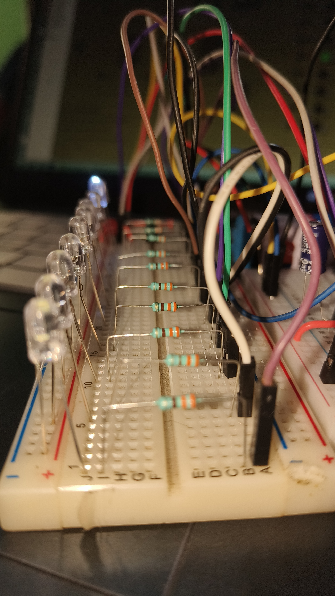
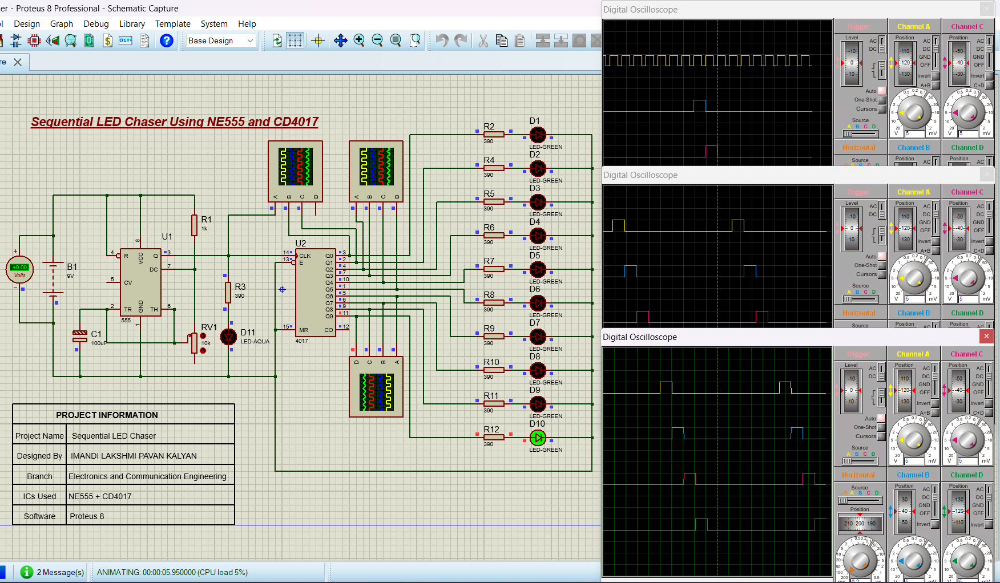
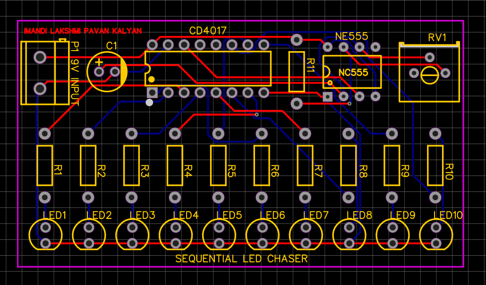
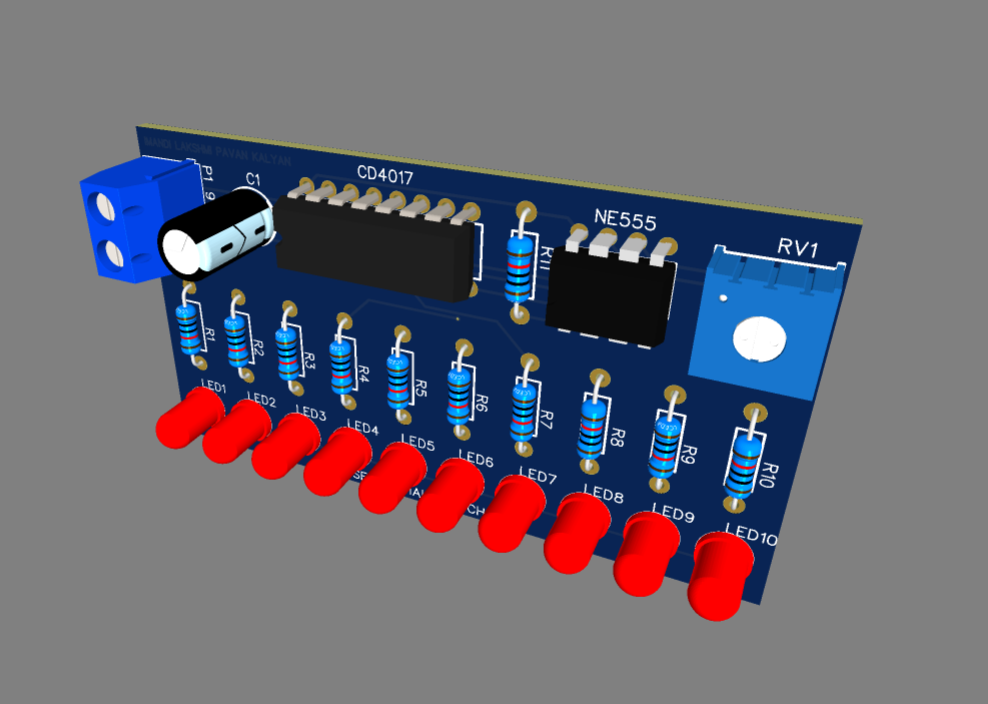
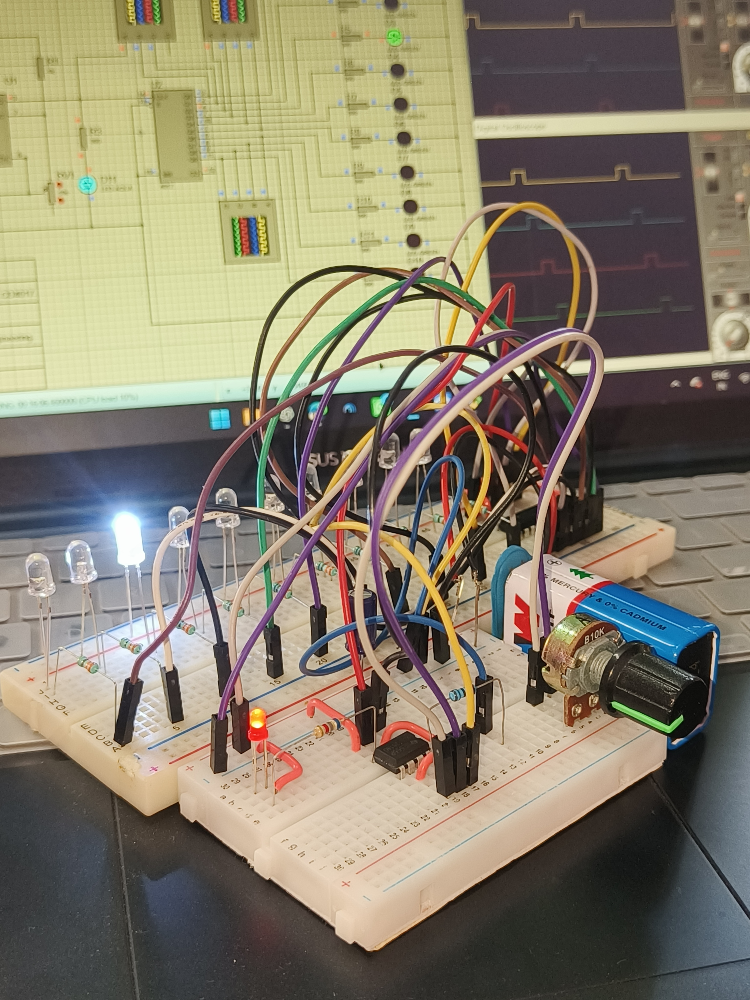
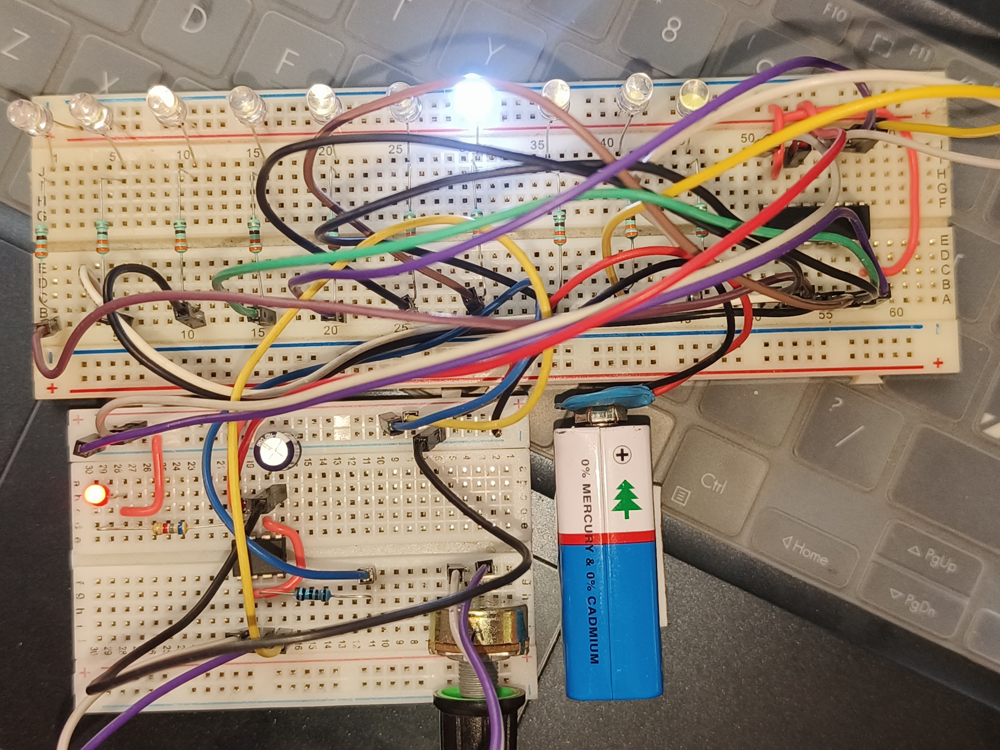

# 🔴 Sequential LED Chaser using NE555 and CD4017

A 10-LED sequential chaser circuit designed using an **NE555 timer** and **CD4017 decade counter**. The NE555 generates the clock pulses, while the CD4017 sequentially activates each LED through individual 390 Ω current-limiting resistors.

The project was **designed and simulated in Proteus, designed as a PCB using EasyEDA, and implemented as a working physical prototype**.

---

## 🎥 Demo Video

The following video demonstrates the working hardware prototype and sequential LED operation.

**[▶️ Watch the Demo Video](YOUR-DEMO-VIDEO-LINK)**

---

## 📸 Project Preview



---

## ✨ Features

* 10-LED sequential chasing effect
* NE555-based clock generation
* CD4017 decade counter for sequential control
* Individual 390 Ω resistors for LED current limiting
* Adjustable LED chasing speed using the 555 timing network
* Proteus circuit simulation
* EasyEDA schematic and PCB design
* PCB Gerber files
* Working physical prototype

---

## ⚙️ Working Principle

The project consists mainly of two stages:

### 1. NE555 Timer

The **NE555 timer** is configured as an oscillator to generate periodic clock pulses.

The timing network consists of resistors, a potentiometer, and a capacitor. Changing the timing resistance changes the charging and discharging time of the capacitor, which changes the clock frequency.

Therefore, the timing network controls the **speed of the LED chasing sequence**.

### 2. CD4017 Decade Counter

The clock pulses generated by the NE555 are applied to the **CD4017 decade counter**.

For every clock pulse, the active output moves to the next output.

```text
NE555 Clock
     │
     ▼
  CD4017
     │
     ├── Q0 → 390 Ω → LED1
     ├── Q1 → 390 Ω → LED2
     ├── Q2 → 390 Ω → LED3
     ├── Q3 → 390 Ω → LED4
     ├── Q4 → 390 Ω → LED5
     ├── Q5 → 390 Ω → LED6
     ├── Q6 → 390 Ω → LED7
     ├── Q7 → 390 Ω → LED8
     ├── Q8 → 390 Ω → LED9
     └── Q9 → 390 Ω → LED10
```

The sequence then repeats continuously.

```text
LED1 → LED2 → LED3 → ... → LED10 → LED1 → ...
```

---

## 🔌 Circuit Configuration

### NE555 Section

The NE555 is used as the clock generator.

The timing capacitor is connected between the timing node and ground. In the implemented circuit, the capacitor value is **1000 µF**.

The timing network controls the frequency of the generated clock signal.

### CD4017 Section

The CD4017 receives the clock signal from the NE555 and activates its outputs sequentially.

Each active output drives one LED through a **390 Ω resistor**.

---

## 💡 LED Output Sequence

| CD4017 Output | Pin | LED   |
| ------------- | --: | ----- |
| Q0            |   3 | LED1  |
| Q1            |   2 | LED2  |
| Q2            |   4 | LED3  |
| Q3            |   7 | LED4  |
| Q4            |  10 | LED5  |
| Q5            |   1 | LED6  |
| Q6            |   5 | LED7  |
| Q7            |   6 | LED8  |
| Q8            |   9 | LED9  |
| Q9            |  11 | LED10 |

Each LED output is connected through an individual **390 Ω current-limiting resistor**.

---

## 🧩 Components Used

| Component         | Quantity | Value / Part                | Purpose               |
| ----------------- | -------: | --------------------------- | --------------------- |
| Timer IC          |        1 | NE555P                      | Clock generation      |
| Decade Counter IC |        1 | CD4017                      | Sequential counting   |
| LEDs              |       10 | 5 mm                        | Sequential indication |
| Resistors         |       10 | 390 Ω                       | LED current limiting  |
| Resistor          |        1 | 1 kΩ                        | 555 timing network    |
| Potentiometer     |        1 | 10 kΩ                       | Speed adjustment      |
| Capacitor         |        1 | 1000 µF                     | Timing                |
| 2-Pin Connector   |        1 | 5.00 mm pitch               | Power input           |
| Power Supply      |        1 | According to circuit design | Circuit power         |

---

## 🖥️ Proteus Simulation

Before building the physical prototype, the circuit was simulated in **Proteus** to verify the operation of the NE555 clock generator and CD4017 sequential outputs.

### Proteus Schematic



The simulation verifies:

* NE555 clock generation
* CD4017 sequential counting
* LED output sequence
* LED current limiting
* Overall circuit operation

The complete Proteus project files are available in:

```text
Proteus/
```

---

## 🖥️ EasyEDA PCB Design

The circuit was converted into a PCB design using **EasyEDA**.

### PCB Layout



### PCB 3D View



The EasyEDA folder contains the schematic, PCB design, and Gerber manufacturing files.

```text
EasyEDA/
├── Schematic/
├── PCB/
├── Gerber/
└── PCB_3D/
```

---

## 🔧 Hardware Prototype

After completing the circuit simulation and PCB design, the circuit was implemented as a physical prototype.

### Front View



### Top View



### Prototype


The physical prototype was tested to verify the sequential LED operation.

---

## 📁 Repository Structure

```text
Sequential-LED-Chaser-NE555-CD4017/
│
├── README.md
│
├── Proteus/
│   ├── Sequential_LED_Chaser.pdsprj
│   ├── Sequential_LED_Chaser.dsn
│   └── Simulation_Screenshot.png
│
├── EasyEDA/
│   ├── Schematic/
│   ├── PCB/
│   ├── Gerber/
│   └── PCB_3D/
│
├── Hardware/
│   ├── Prototype_Front.jpg
│   ├── Prototype_Back.jpg
│   ├── Prototype_Side.jpg
│   └── Working_Prototype.jpg
│
└── Images/
    ├── Circuit_Schematic.png
    ├── Proteus_Simulation.png
    ├── EasyEDA_PCB.png
    ├── PCB_3D_View.png
    └── Final_Prototype.png
```

---

## 🧪 Project Development Flow

```text
Circuit Design
      ↓
Proteus Simulation
      ↓
EasyEDA Schematic
      ↓
PCB Layout
      ↓
Gerber Generation
      ↓
Hardware Prototype
      ↓
Testing
      ↓
Working Demonstration
```

---

## 🚀 Future Improvements

Possible improvements for future versions include:

* Adjustable chasing patterns
* Bidirectional LED chasing
* LED fade-in and fade-out effects
* Multiple LED animation modes
* Improved PCB enclosure
* Transistor/MOSFET-based LED driving
* Microcontroller-based programmable patterns
* Speed control using a dedicated potentiometer

---

## 📚 Learning Outcomes

Through this project, I gained practical experience in:

* 555 timer oscillator circuits
* Decade counter operation
* Digital sequential logic
* LED current limiting
* Timing circuits
* Proteus circuit simulation
* Schematic design
* PCB design using EasyEDA
* Gerber file generation
* Hardware prototyping and testing

---

## 👨‍💻 Author

**Lakshmi Pavan Kalyan Imandi**

Electronics & Communication Engineering

GitHub: **[Your GitHub Profile](YOUR-GITHUB-PROFILE-LINK)**

LinkedIn: **[Your LinkedIn Profile](YOUR-LINKEDIN-LINK)**

---

## ⭐ Project

If you find this project useful or interesting, consider giving the repository a ⭐ on GitHub.
